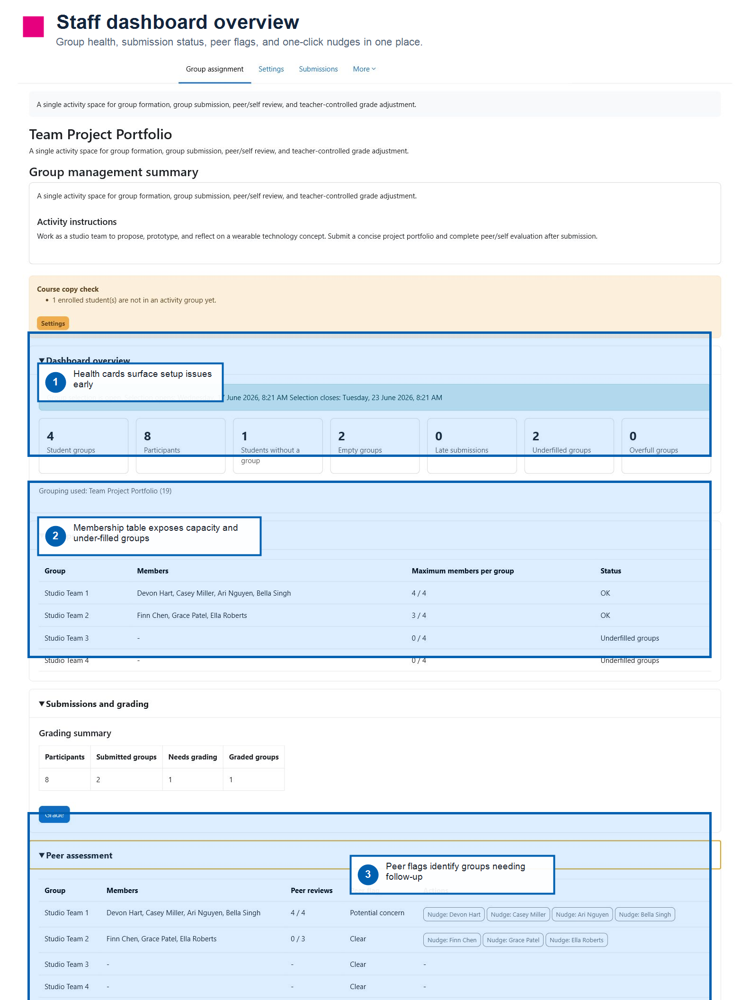
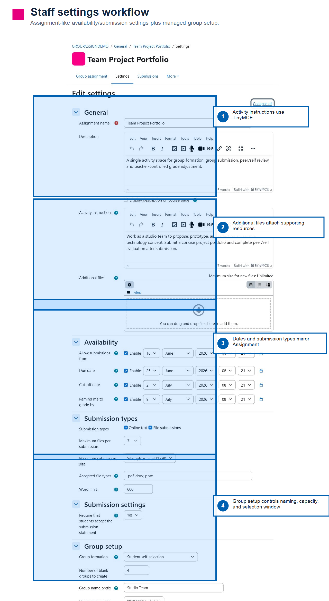
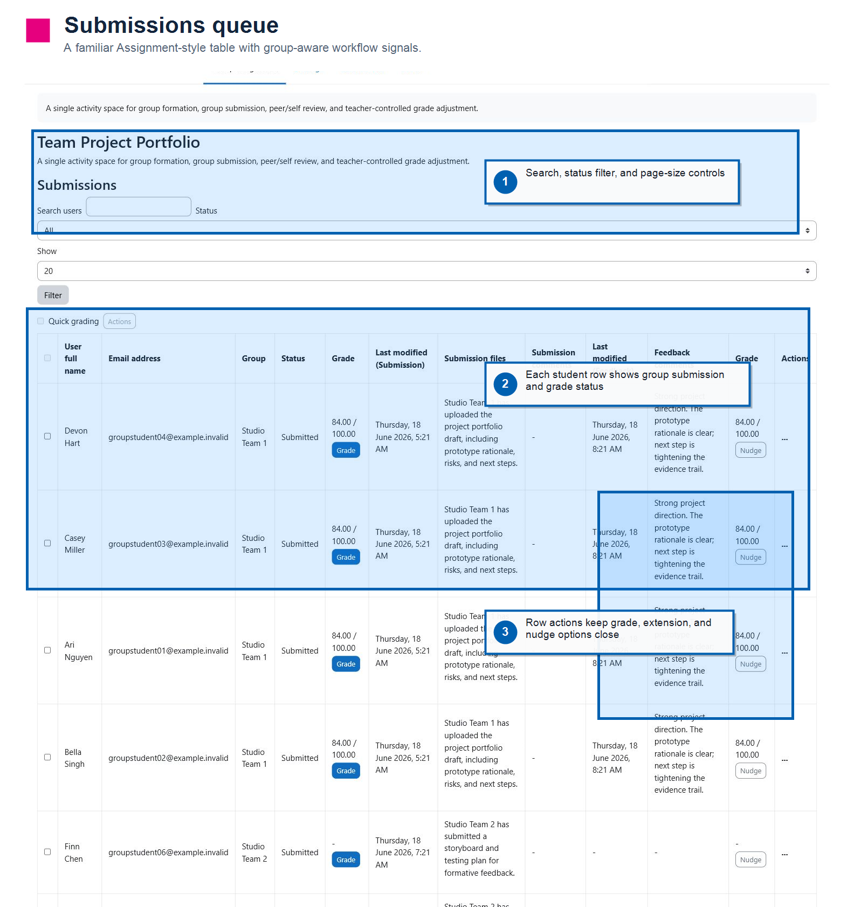
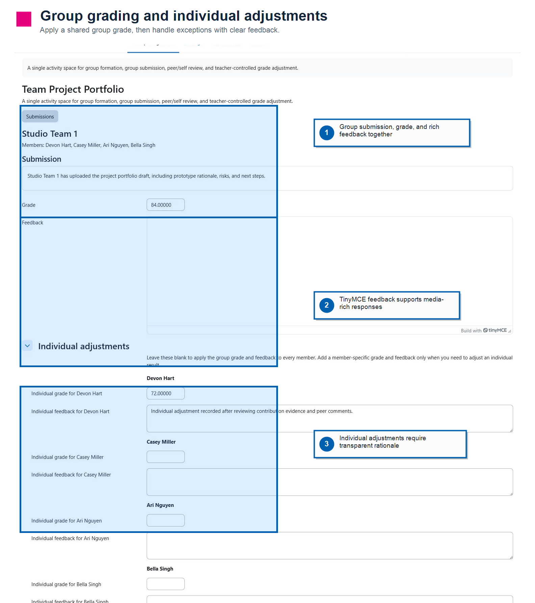
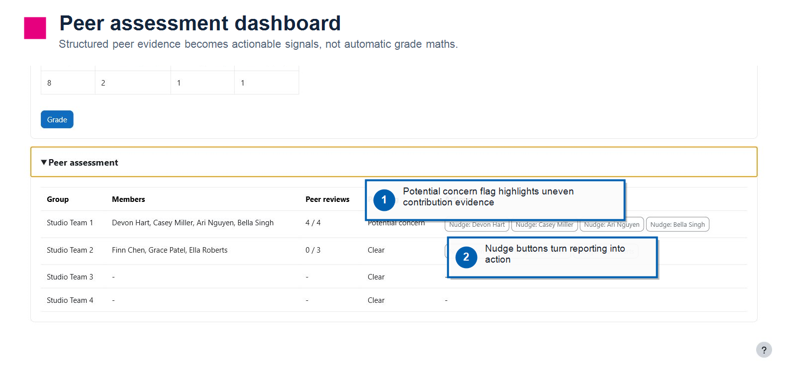
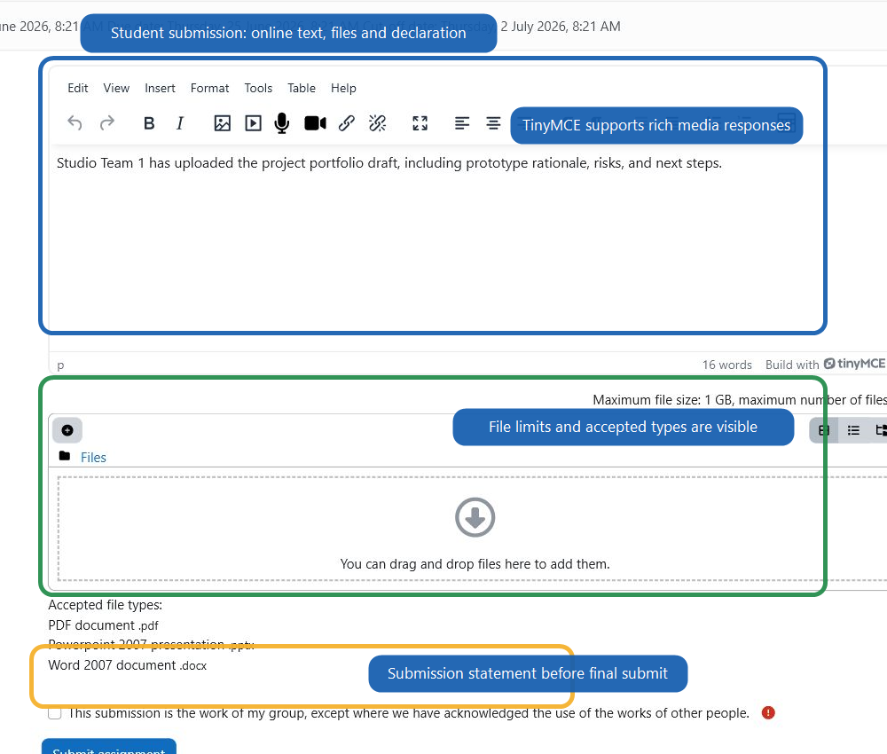
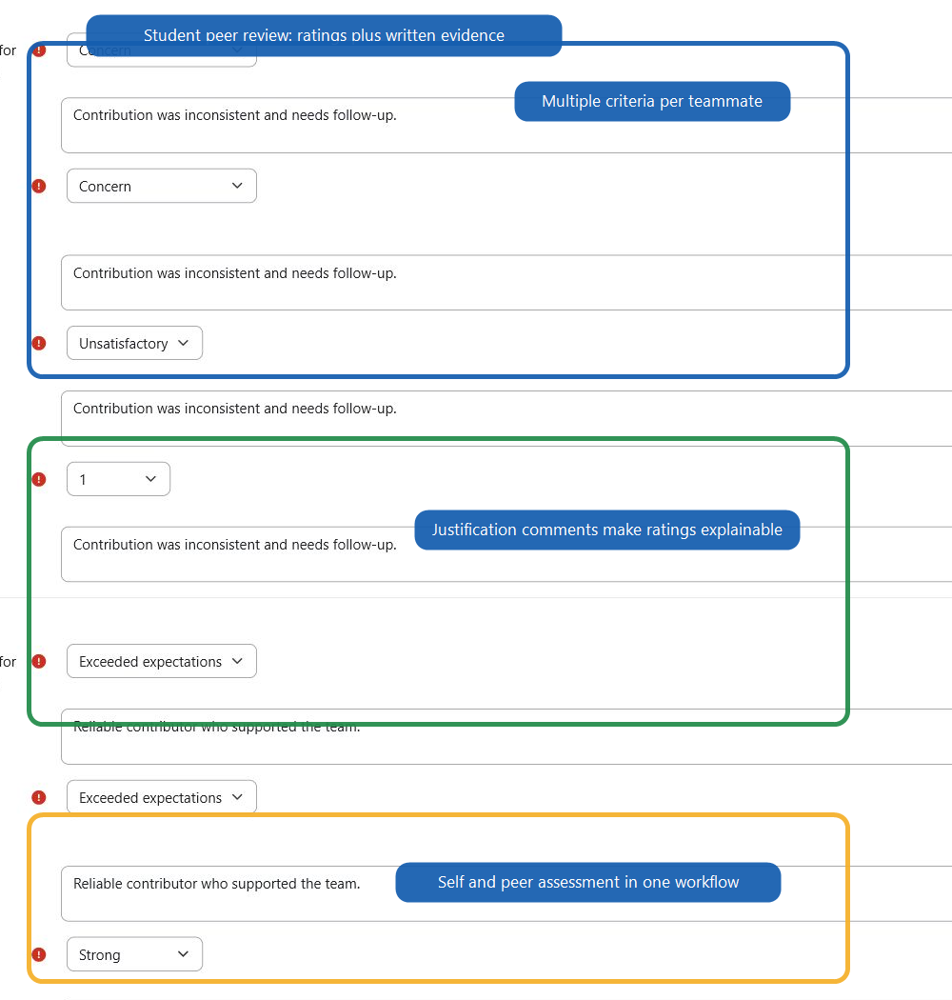

# Group assignment prototype

`mod_groupassign` is an early Moodle activity prototype for group assignments that combine group formation, group submission, peer/self evaluation, and teacher-controlled grade adjustment in one activity.

## Installation

The Moodle component is `mod_groupassign`, so the folder inside Moodle must be `mod/groupassign`.

Recommended developer install:

```bash
git clone https://github.com/AceMcCloud-Skybolt/moodle-mod_groupassignment.git /path/to/moodle/public/mod/groupassign
```

Do not install a raw GitHub source ZIP if Moodle expands it as `groupassignment` or `moodle-mod_groupassignment-main`; Moodle will treat that as `mod_groupassignment` and reject the plugin. For ZIP installs, build an installable package with:

```powershell
powershell -ExecutionPolicy Bypass -File .\tools\build-package.ps1
```

That creates `dist/groupassign.zip` with the correct top-level folder.

## Concept and requirements brief

For a non-code handoff explaining why this activity is needed, what problems it solves, target users, core use cases, MVP requirements, future ideas, and developer review questions, see:

[`docs/group-assignment-product-brief.md`](docs/group-assignment-product-brief.md)

## Current prototype slice

- Appears in the Moodle activity picker as **Group assignment**.
- Provides Assignment-like availability, submission, feedback, gradebook, calendar/timeline, backup/restore, and reporting entry points.
- Provides group formation settings:
  - student self-selection
  - teacher-managed blank group creation
  - use existing grouping
  - group naming prefix and number/letter suffixes
  - min/max group sizes
  - selection open/close dates
  - student join/leave/create permissions
- Automatically creates a dedicated Moodle grouping and blank groups when configured to manage groups.
- Teacher dashboard shows group health cards, collapsible group/member views, a grading summary, peer assessment flags, and direct action buttons.
- Submissions view follows the native Moodle Assignment table pattern, with search, status filtering, quick grading, row actions, grade, and nudge controls.
- Student view lets students join/leave available groups, submit online text/files, and complete structured peer/self review.
- Peer assessment criteria can include title, description, scoring type, comments, and required justification.
- Group grading supports a shared group grade with individual adjustment fields for teacher-controlled exceptions.

## Screenshots

These screenshots use a synthetic local demo course and demo users only.

| Dashboard overview | Settings and group setup |
| --- | --- |
|  |  |

| Submissions queue | Group grading |
| --- | --- |
|  |  |

| Peer dashboard flags | Student submission flow |
| --- | --- |
|  |  |

| Student peer review |
| --- | --- |
|  |

## Design direction

This prototype should keep Moodle's native Assignment mental model while reducing the setup burden around Groups and Groupings. Peer/self evaluation should initially be treated as structured evidence for teachers, not an automatic grade redistribution formula.

## Still to harden

- Gradebook scale/no-grade workflows need further developer review and smoke testing.
- Course copy, reset, and backup/restore should be tested with realistic teaching data.
- Notifications, extension workflows, and richer Assignment-style row actions remain deferred.
- Automated PHPUnit/Behat tests and renderer/table refactors remain future hardening.
