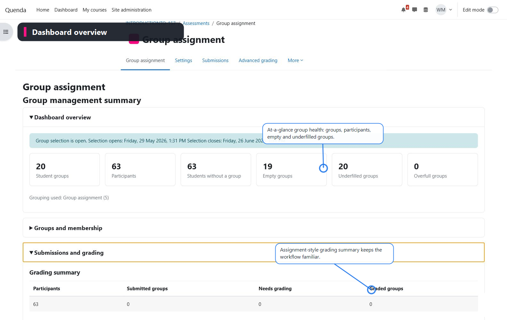
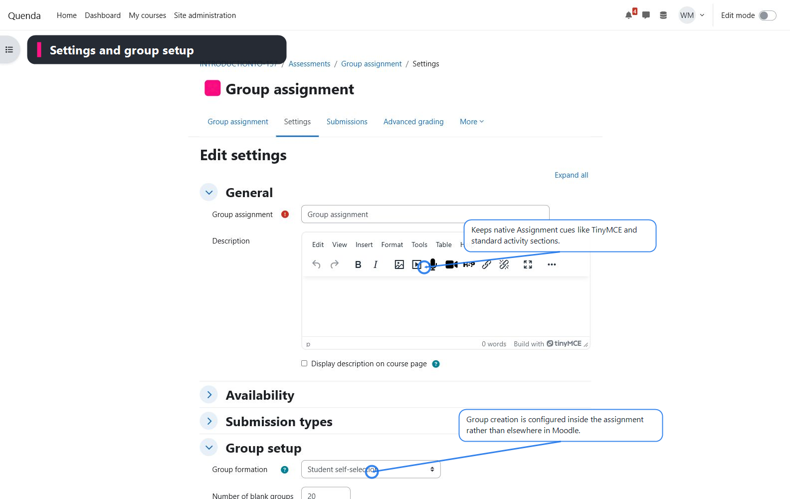
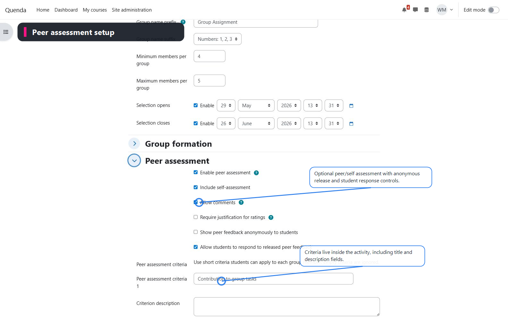
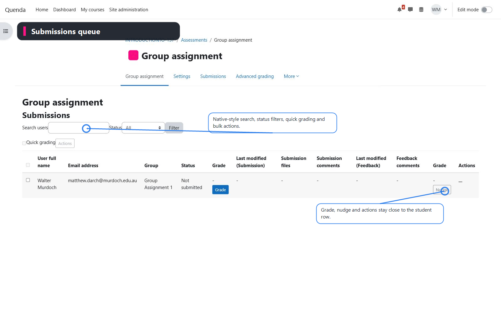
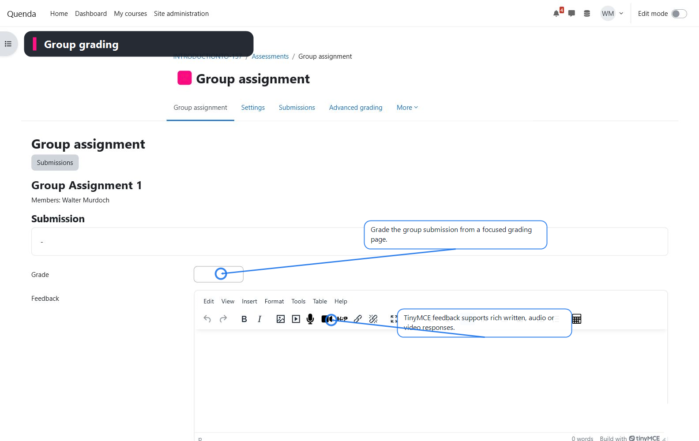
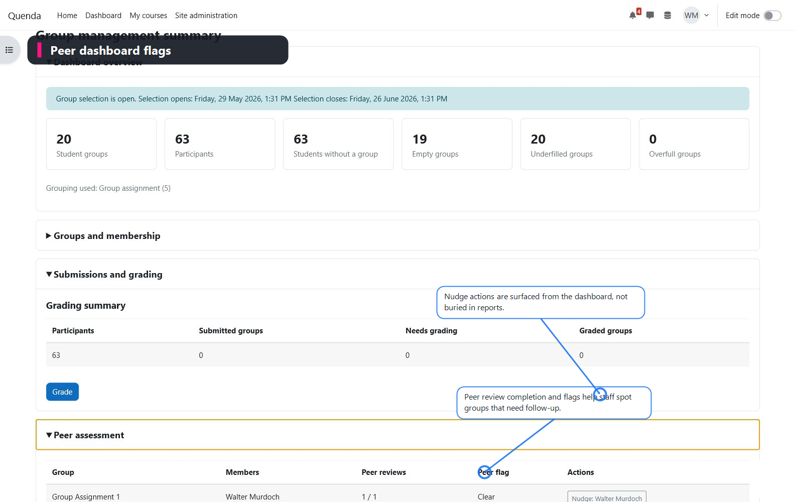
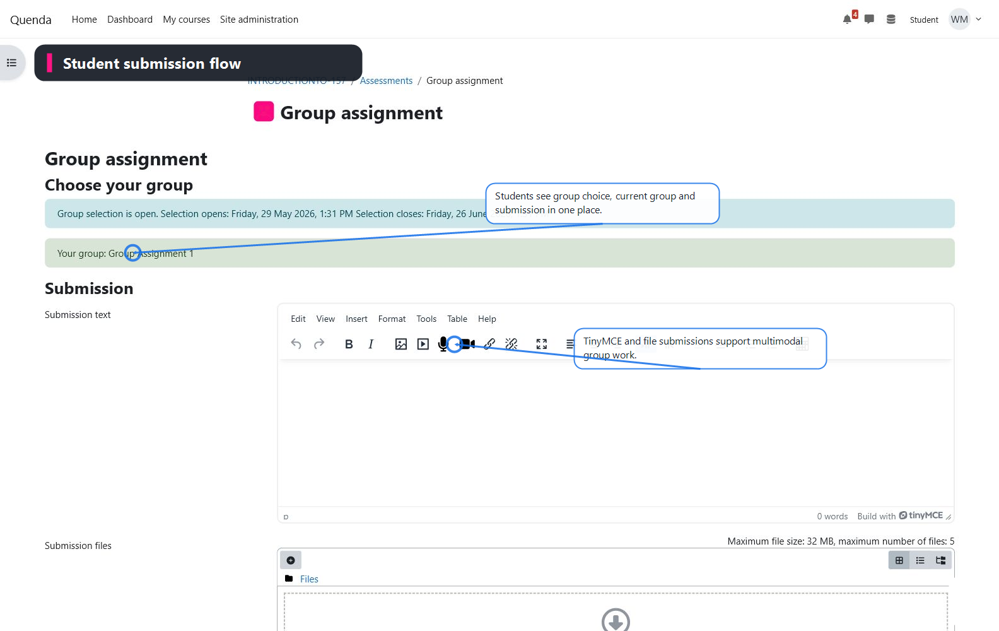
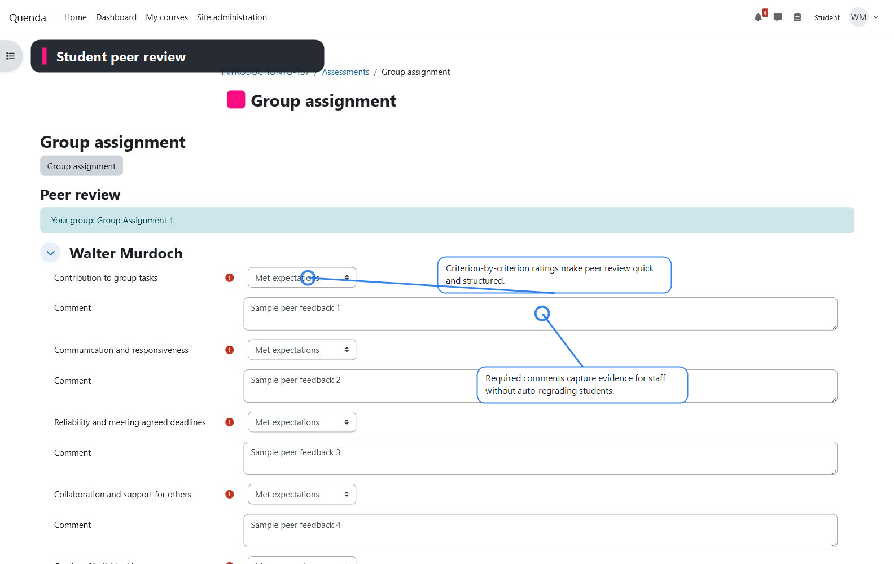

# Group assignment prototype

`mod_groupassign` is an early Moodle activity prototype for group assignments that combine group formation, group submission, peer/self evaluation, and teacher-controlled grade adjustment in one activity.

## Current prototype slice

- Appears in the Moodle activity picker as **Group assignment**.
- Provides Assignment-like availability, submission, feedback, grade, notification, completion, and advanced grading entry points.
- Provides group formation settings:
  - student self-selection
  - teacher-managed blank group creation
  - use existing grouping
  - group naming prefix and number/letter suffixes
  - min/max group sizes
  - selection open/close dates
  - student join/leave/create permissions
- Automatically creates a dedicated Moodle grouping and blank groups when configured to manage groups.
- Teacher dashboard shows group health cards, collapsible group/member views, a grading summary, peer assessment flags, and direct action buttons.
- Submissions view follows the native Moodle Assignment table pattern, with search, status filtering, quick grading, row actions, grade, and nudge controls.
- Student view lets students join/leave available groups, submit online text/files, and complete structured peer/self review.
- Peer assessment criteria can include title, description, scoring type, comments, justification, anonymous release, and student response options.
- Group grading supports a shared group grade with individual adjustment fields for teacher-controlled exceptions.

## Screenshots

| Dashboard overview | Settings and group setup |
| --- | --- |
|  |  |

| Peer assessment setup | Submissions queue |
| --- | --- |
|  |  |

| Group grading | Peer dashboard flags |
| --- | --- |
|  |  |

| Student submission flow | Student peer review |
| --- | --- |
|  |  |

## Design direction

This prototype should keep Moodle's native Assignment mental model while reducing the setup burden around Groups and Groupings. Peer/self evaluation should initially be treated as structured evidence for teachers, not an automatic grade redistribution formula.

## Still to harden

- Calendar/timeline events.
- Backup/restore.
- Broader parity with Assignment row actions and extension workflows.
- Automated tests and developer review of Moodle API edge cases.
